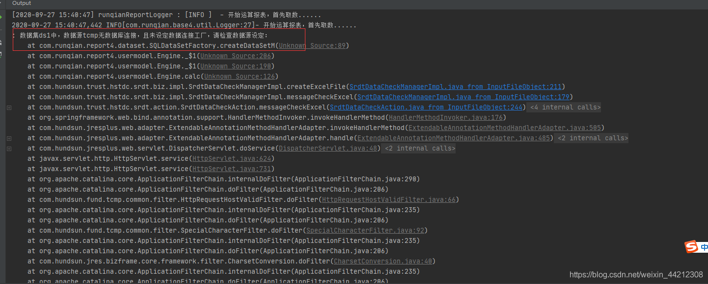

### 涉及文件

- reportConfig.xml

  > 数据源，导出配置相关的东西需要看看

```xml
<?xml version="1.0" encoding="UTF-8" ?>
<reportConfig>
    <config>
      <name>logConfig</name>
      <value>/WEB-INF/classes/logger.properties</value>
    </config>
    <config>
      <name>license</name>
      <value>/WEB-INF/ServerHStcmpV4.0Windows.lic</value>
    </config>
    <config>
      <name>reportFileHome</name>
      <value>/reportFiles</value>
    </config>
    <config>
      <name>semanticsFile</name>
      <value></value>
    </config>
    <config>
      <name>JNDIPrefix</name>
      <!-- java:comp/env -->
      <value>java:comp/env</value>
    </config>
    <config>
      <name>dataSource</name>
      <value>tcmp,oracle,gbk</value>
    </config>
    <config>
      <name>jspCharset</name>
      <value>GBK</value>
    </config>
	<config>
      <name>alwaysReloadDefine</name>
      <value>yes</value>
    </config>
    <config>
      <name>cachedParamsTimeout</name>
      <value>120</value>
    </config>
    <config>
      <name>cachedReportDir</name>
      <value>report\cached</value>
    </config>
    <config>
      <name>cachedIdPrefix</name>
      <value>A</value>
    </config>
    <config>
      <name>cachedReportTimeout</name>
      <value>120</value>
    </config>
    <config>
      <name>maxCellNum</name>
      <value>200000</value>
    </config>
    <config>
      <name>maxConcurrentForReport</name>
      <value></value>
    </config>
    <config>
      <name>maxWaitForReport</name>
      <value>10</value>
    </config>
    <config>
      <name>maxWaitTimeForReport</name>
      <value>30</value>
    </config>
    <config>
      <name>appUrlPrefix</name>
      <value></value>
    </config>
    <config>
      <name>errorPage</name>
      <value>/reportJsp/myError.jsp</value>
    </config>
    <config>
        <name>jreInstallName</name>
        <value>/jre-6u24-windows-i586.exe#Version=1,6,0,0</value>
    </config>
    <config>
        <name>jreVersion</name>
        <value>1.6</value>
    </config>
</reportConfig>

```

- 出错提示



### 润乾报表路径

> E:\IdeaWorkPlace\hs\Esst4.0_01\webapp-hstdc\WebContent\reportFiles\downloadTemplate\tusp\srdt